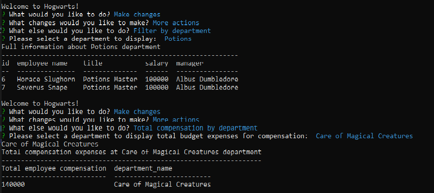

# Welcome to Hogwart's Content Management System or HCMS! 🔮
## _A back-end application that allows business owners manage their organization's departments, roles and employees._ 
#### _For easier navigation please refer to the links below._
### Navigation
 
- [Functionality and description](#functionality)
- [How-to-use Guide](#guide)
- [Sample Screenshot](#sample-page)
- [Reach Out](#contact💌)
  

> ### **Functionality**🔧
This command-line application was built in **Node.js** environment with implementation of **Inquirer, mysql2, console.table packages** and **MySQL database** to store and retrieve data.  
The repository consists of root directory that contains **db** subdirectory with MySQL files and connection point. **Utils** directory has all query files that are separated into 3 section _(refer to the Guide)_ and the main **index.js** is located in the root directory.
  

> ### **Guide**🗒️
Once all dependencies are installed _(can be found in package.json file)_, you can simply run **node index.js** to start interaction with the command line. 
For a better user experience the options were divided into **3 sections:** 
>> First, you are prompted to simply view all the departments, roles and employees in your organization. 
If you would like to add new information about a new department/role or in case you hired a new employee and would like to add them to the team, simply run **_'Make Changes'_** option and you will be able to alter any of those tables individually.  
Lastly, there are additional options for more specific needs: filter by department, delete a role in a department or see how much from company's budget goes into employees' compensation in each department.
  

Once you're done using application, select _'Exit'_  
_Since this is a first production version of HCMS, the developer is opened to any suggestions that may improve user experience. Feel free to reach out using contact info below_ 
  

> ### **Sample**📌
Below you can find a screenshot of an example request to a database, as well the link to [video](https://drive.google.com/file/d/1Rh7TNWR-JFzyQkt1LF_hbKjQV1LpFE3z/view) demonstration  
  

  

> ### **Reach Out**🦉
If you have any questions or would like to leave a feedback as a user, please feel free to reach out [here💬](https://www.linkedin.com/in/valeriya-kim-763572204/)  
**Thank you for visiting!**